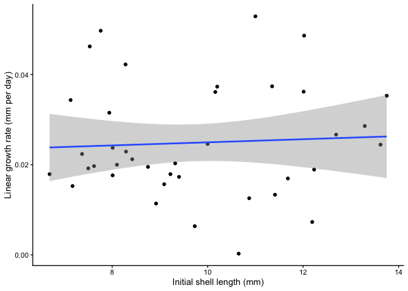
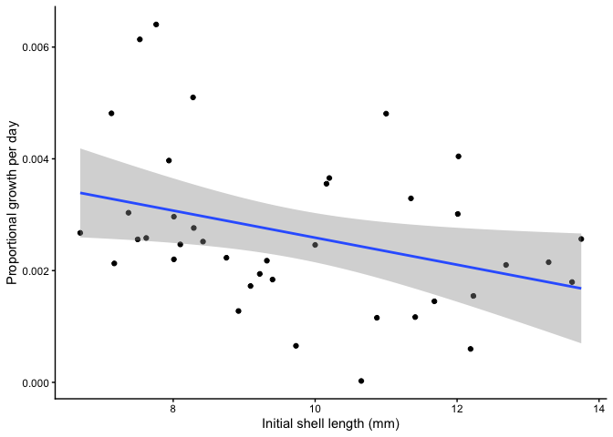
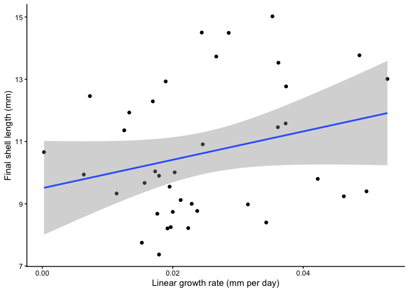
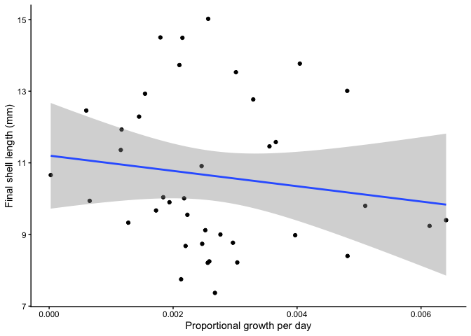
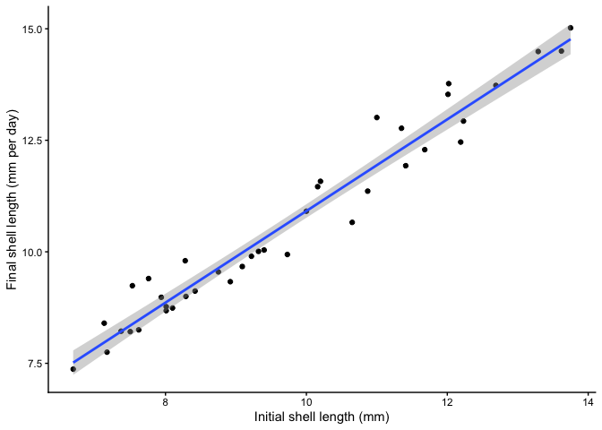
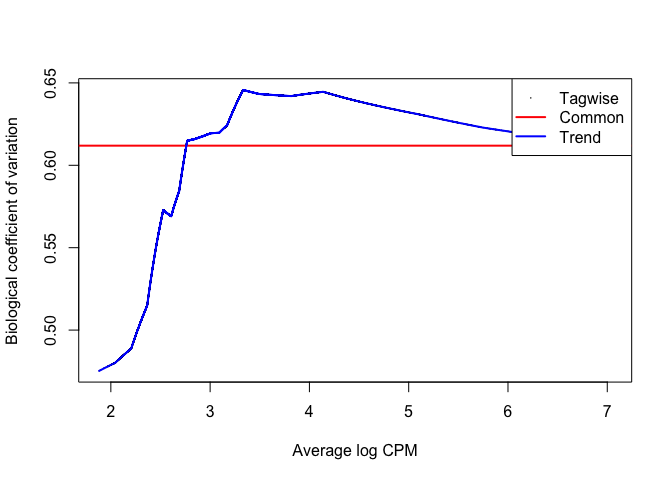
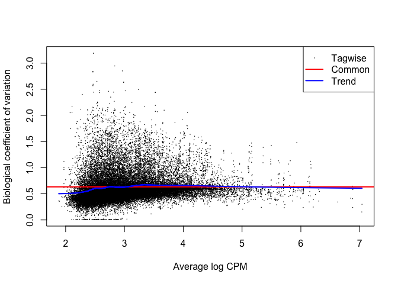
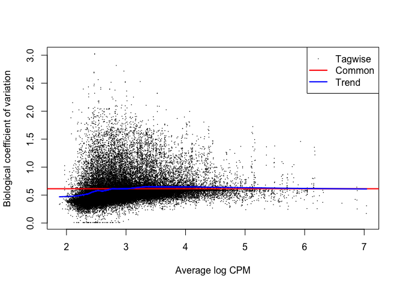
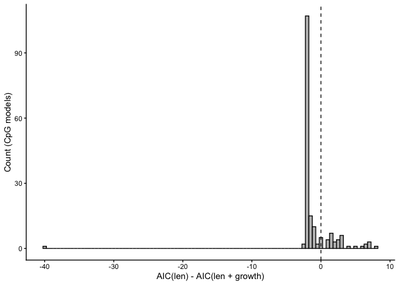
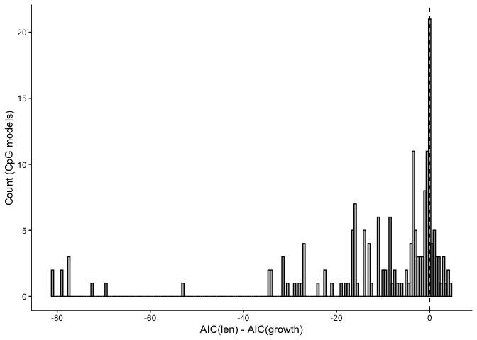

sb_growth_reanalysis
================
Sam Bogan
2026-02-26

This is a reanalysis and adaptation of Tina’s code by Sam in response to
the comment by reviewer 2 that we should evaluate initial shell size
and/or growth rate as a covariate in our DM tests.

The first thing we’ll want to do is see if the association between
initial shell size and growth rate is flat (linear growth), positive
(exponential growth) or non-linear/negative (logarithmic growth).

## Look at shell length and growth

``` r
# Read in shell metadata
shell_df <- read.csv("Data/full_sample.csv")

# Calc linear growth rate and make one row for each mussel individual
shell_df <- shell_df %>%
  dplyr::mutate(
    DATE_INIT = mdy(DATE_INIT),
    DATE_SAMPLED = mdy(DATE_SAMPLED)
    ) %>%
  mutate(
    days_elapsed = as.numeric(DATE_SAMPLED - DATE_INIT),
    mm_per_d = (LENGTH_FINAL..mm. - LENGTH_INIT..mm.) / days_elapsed,
    prop_mm_per_d = ((LENGTH_FINAL..mm. - LENGTH_INIT..mm.) / days_elapsed) / LENGTH_INIT..mm.
  ) %>%
  distinct(sample.ID, .keep_all = TRUE)

# Plot initial length vs linear growth rate
# growth is linearbut doesn't correlate well with initial shell size
ggplot(data = shell_df,
       aes(x = `LENGTH_INIT..mm.`, y = mm_per_d)) +
  geom_point() +
  geom_smooth(method = "lm") +
  theme_classic() +
  labs(x = "Initial shell length (mm)", y = "Linear growth rate (mm per day)")
```

    ## `geom_smooth()` using formula = 'y ~ x'

<!-- -->

``` r
# Now proportional growth
ggplot(data = shell_df,
       aes(x = `LENGTH_INIT..mm.`, y = prop_mm_per_d)) +
  geom_point() +
  geom_smooth(method = "lm") +
  theme_classic() +
  labs(x = "Initial shell length (mm)", y = "Proportional growth per day")
```

    ## `geom_smooth()` using formula = 'y ~ x'

<!-- -->

``` r
# What about final shell length and growth rate?
# Slightly better correlation, and expected positive relationship...
# Higher growth rate results in bigger final shell length
ggplot(data = shell_df,
       aes(y = `LENGTH_FINAL..mm.`, x = mm_per_d)) +
  geom_point() +
  geom_smooth(method = "lm") +
  theme_classic() +
  labs(y = "Final shell length (mm)", x = "Linear growth rate (mm per day)")
```

    ## `geom_smooth()` using formula = 'y ~ x'

<!-- -->

``` r
# Now proportional growth
ggplot(data = shell_df,
       aes(y = `LENGTH_FINAL..mm.`, x = prop_mm_per_d)) +
  geom_point() +
  geom_smooth(method = "lm") +
  theme_classic() +
  labs(y = "Final shell length (mm)", x = "Proportional growth per day")
```

    ## `geom_smooth()` using formula = 'y ~ x'

<!-- -->

``` r
# What about correlation between initial and final size?
ggplot(data = shell_df,
       aes(x = `LENGTH_INIT..mm.`, y = LENGTH_FINAL..mm.)) +
  geom_point() +
  geom_smooth(method = "lm") +
  theme_classic() +
  labs(x = "Initial shell length (mm)", y = "Final shell length (mm per day)")
```

    ## `geom_smooth()` using formula = 'y ~ x'

<!-- -->

``` r
# No correlation is tight enough to say that final shell length is a proxy for initial

# Proportional growth rate is non-independent of initial length, so I'm going to avoid using that

# Three models make sense and do not run into non-independence issues
# 1. initial length (basically the same as final growth according to correlation)
# 2. growth rate
# 3. initial length + mm growth rate

# There is no need to fit a model with proportional growth bc 
# the slope of mm growth across initial size = 0
```

Runs of Tina’s DM code with the three models above (one old; two new)

``` r
# Load DM packages
library(vegan)
```

    ## Warning: package 'vegan' was built under R version 4.2.3

    ## Loading required package: permute

    ## Loading required package: lattice

    ## This is vegan 2.6-6.1

``` r
library(edgeR)
```

    ## Loading required package: limma

``` r
library(SYNCSA)
library(mice)
```

    ## 
    ## Attaching package: 'mice'

    ## The following object is masked from 'package:stats':
    ## 
    ##     filter

    ## The following objects are masked from 'package:base':
    ## 
    ##     cbind, rbind

``` r
library(ape)
```

    ## Warning: package 'ape' was built under R version 4.2.3

    ## 
    ## Attaching package: 'ape'

    ## The following object is masked from 'package:dplyr':
    ## 
    ##     where

``` r
library(rtracklayer)
```

    ## Loading required package: GenomicRanges

    ## Loading required package: stats4

    ## Loading required package: BiocGenerics

    ## 
    ## Attaching package: 'BiocGenerics'

    ## The following objects are masked from 'package:mice':
    ## 
    ##     cbind, rbind

    ## The following object is masked from 'package:limma':
    ## 
    ##     plotMA

    ## The following objects are masked from 'package:lubridate':
    ## 
    ##     intersect, setdiff, union

    ## The following objects are masked from 'package:dplyr':
    ## 
    ##     combine, intersect, setdiff, union

    ## The following objects are masked from 'package:stats':
    ## 
    ##     IQR, mad, sd, var, xtabs

    ## The following objects are masked from 'package:base':
    ## 
    ##     anyDuplicated, aperm, append, as.data.frame, basename, cbind,
    ##     colnames, dirname, do.call, duplicated, eval, evalq, Filter, Find,
    ##     get, grep, grepl, intersect, is.unsorted, lapply, Map, mapply,
    ##     match, mget, order, paste, pmax, pmax.int, pmin, pmin.int,
    ##     Position, rank, rbind, Reduce, rownames, sapply, setdiff, sort,
    ##     table, tapply, union, unique, unsplit, which.max, which.min

    ## Loading required package: S4Vectors

    ## 
    ## Attaching package: 'S4Vectors'

    ## The following objects are masked from 'package:lubridate':
    ## 
    ##     second, second<-

    ## The following objects are masked from 'package:dplyr':
    ## 
    ##     first, rename

    ## The following object is masked from 'package:tidyr':
    ## 
    ##     expand

    ## The following objects are masked from 'package:base':
    ## 
    ##     expand.grid, I, unname

    ## Loading required package: IRanges

    ## 
    ## Attaching package: 'IRanges'

    ## The following object is masked from 'package:lubridate':
    ## 
    ##     %within%

    ## The following objects are masked from 'package:dplyr':
    ## 
    ##     collapse, desc, slice

    ## The following object is masked from 'package:purrr':
    ## 
    ##     reduce

    ## Loading required package: GenomeInfoDb

``` r
library(genomation)
```

    ## Loading required package: grid

    ## Warning: replacing previous import 'Biostrings::pattern' by 'grid::pattern'
    ## when loading 'genomation'

``` r
library(plyranges)
```

    ## 
    ## Attaching package: 'plyranges'

    ## The following object is masked from 'package:IRanges':
    ## 
    ##     slice

    ## The following objects are masked from 'package:dplyr':
    ## 
    ##     between, n, n_distinct

    ## The following object is masked from 'package:stats':
    ## 
    ##     filter

``` r
library(GenomicRanges)
library(lme4)
```

    ## Warning: package 'lme4' was built under R version 4.2.3

    ## Loading required package: Matrix

    ## Warning: package 'Matrix' was built under R version 4.2.3

    ## 
    ## Attaching package: 'Matrix'

    ## The following object is masked from 'package:S4Vectors':
    ## 
    ##     expand

    ## The following objects are masked from 'package:tidyr':
    ## 
    ##     expand, pack, unpack

``` r
library(emmeans)
```

    ## Welcome to emmeans.
    ## Caution: You lose important information if you filter this package's results.
    ## See '? untidy'

``` r
library(ggthemes)
library(rstatix)
```

    ## 
    ## Attaching package: 'rstatix'

    ## The following object is masked from 'package:IRanges':
    ## 
    ##     desc

    ## The following object is masked from 'package:stats':
    ## 
    ##     filter

``` r
library(coin)
```

    ## Loading required package: survival

    ## 
    ## Attaching package: 'coin'

    ## The following objects are masked from 'package:rstatix':
    ## 
    ##     chisq_test, friedman_test, kruskal_test, sign_test, wilcox_test

``` r
library(tidyverse)
```

## Start with foot

``` r
### Load metadata file that include sample names, load all coverage files into R ###
setwd("Data/foot_coverage_files/")
meta_data_foot<-read.delim("foot_final_metadata.txt", row.names = "sample", stringsAsFactors = FALSE)
Sample_foot <- row.names(meta_data_foot)
files_foot <- paste0("foot_samples/", Sample_foot,".CpG_report.merged_CpG_evidence.cov.CpG_report.merged_CpG_evidence.cov")

### EdgeR function readBismark2DGE reads all the files and collates the counts for all the sample into one data object ###
yall <- readBismark2DGE(files_foot, sample.names=Sample_foot)
```

    ## Reading foot_samples/12O-F_S66.CpG_report.merged_CpG_evidence.cov.CpG_report.merged_CpG_evidence.cov 
    ## Reading foot_samples/86G-F_S75.CpG_report.merged_CpG_evidence.cov.CpG_report.merged_CpG_evidence.cov 
    ## Reading foot_samples/29Y-F_S74.CpG_report.merged_CpG_evidence.cov.CpG_report.merged_CpG_evidence.cov 
    ## Reading foot_samples/40Y-F_S84.CpG_report.merged_CpG_evidence.cov.CpG_report.merged_CpG_evidence.cov 
    ## Reading foot_samples/15G-F_S52.CpG_report.merged_CpG_evidence.cov.CpG_report.merged_CpG_evidence.cov 
    ## Reading foot_samples/47W-F_S82.CpG_report.merged_CpG_evidence.cov.CpG_report.merged_CpG_evidence.cov 
    ## Reading foot_samples/55B-F_S4.CpG_report.merged_CpG_evidence.cov.CpG_report.merged_CpG_evidence.cov 
    ## Reading foot_samples/55Y-F_S61.CpG_report.merged_CpG_evidence.cov.CpG_report.merged_CpG_evidence.cov 
    ## Reading foot_samples/61W-F_S38.CpG_report.merged_CpG_evidence.cov.CpG_report.merged_CpG_evidence.cov 
    ## Reading foot_samples/67B-F_S20.CpG_report.merged_CpG_evidence.cov.CpG_report.merged_CpG_evidence.cov 
    ## Reading foot_samples/45G-F_S32.CpG_report.merged_CpG_evidence.cov.CpG_report.merged_CpG_evidence.cov 
    ## Reading foot_samples/6W-F_S50.CpG_report.merged_CpG_evidence.cov.CpG_report.merged_CpG_evidence.cov 
    ## Reading foot_samples/72Y-F_S28.CpG_report.merged_CpG_evidence.cov.CpG_report.merged_CpG_evidence.cov 
    ## Reading foot_samples/60G-F_S65.CpG_report.merged_CpG_evidence.cov.CpG_report.merged_CpG_evidence.cov 
    ## Reading foot_samples/81G-F_S79.CpG_report.merged_CpG_evidence.cov.CpG_report.merged_CpG_evidence.cov 
    ## Reading foot_samples/76G-F_S46.CpG_report.merged_CpG_evidence.cov.CpG_report.merged_CpG_evidence.cov 
    ## Reading foot_samples/89Y-F_S31.CpG_report.merged_CpG_evidence.cov.CpG_report.merged_CpG_evidence.cov 
    ## Reading foot_samples/90W-F_S21.CpG_report.merged_CpG_evidence.cov.CpG_report.merged_CpG_evidence.cov 
    ## Reading foot_samples/91W-F_S30.CpG_report.merged_CpG_evidence.cov.CpG_report.merged_CpG_evidence.cov 
    ## Reading foot_samples/50G-F_S13.CpG_report.merged_CpG_evidence.cov.CpG_report.merged_CpG_evidence.cov 
    ## Hashing ...
    ## Collating counts ...

``` r
### Check dimension and the count matrix ###
dim(yall)
```

    ## [1] 1972678      40

``` r
head(yall$counts)
```

    ##                      12O-F_S66-Me 12O-F_S66-Un 86G-F_S75-Me 86G-F_S75-Un
    ## NW_026262581.1-97825            0            2            0           10
    ## NW_026262581.1-97832            0            2            0           10
    ## NW_026262581.1-97836            0            2            0           10
    ## NW_026262581.1-97843            0            2            0           10
    ## NW_026262581.1-97856            0            2            0           10
    ## NW_026262581.1-97859            0            2            0           10
    ##                      29Y-F_S74-Me 29Y-F_S74-Un 40Y-F_S84-Me 40Y-F_S84-Un
    ## NW_026262581.1-97825            0            1            4            9
    ## NW_026262581.1-97832            0            1            0           13
    ## NW_026262581.1-97836            0            1            0           13
    ## NW_026262581.1-97843            0            1            0           13
    ## NW_026262581.1-97856            0            1            0           13
    ## NW_026262581.1-97859            0            1            0           13
    ##                      15G-F_S52-Me 15G-F_S52-Un 47W-F_S82-Me 47W-F_S82-Un
    ## NW_026262581.1-97825            0           19            0            3
    ## NW_026262581.1-97832            0           19            0            3
    ## NW_026262581.1-97836            0           19            0            3
    ## NW_026262581.1-97843            0           19            0            3
    ## NW_026262581.1-97856            0           19            0            3
    ## NW_026262581.1-97859            0           19            0            3
    ##                      55B-F_S4-Me 55B-F_S4-Un 55Y-F_S61-Me 55Y-F_S61-Un
    ## NW_026262581.1-97825           0           7            0            3
    ## NW_026262581.1-97832           0           7            0            3
    ## NW_026262581.1-97836           0           7            0            3
    ## NW_026262581.1-97843           0           7            0            3
    ## NW_026262581.1-97856           0           7            0            3
    ## NW_026262581.1-97859           0           7            0            3
    ##                      61W-F_S38-Me 61W-F_S38-Un 67B-F_S20-Me 67B-F_S20-Un
    ## NW_026262581.1-97825            0            2            0            2
    ## NW_026262581.1-97832            0            2            0            2
    ## NW_026262581.1-97836            0            2            0            2
    ## NW_026262581.1-97843            0            2            0            2
    ## NW_026262581.1-97856            0            2            0            2
    ## NW_026262581.1-97859            0            2            0            2
    ##                      45G-F_S32-Me 45G-F_S32-Un 6W-F_S50-Me 6W-F_S50-Un
    ## NW_026262581.1-97825            0            9           0          14
    ## NW_026262581.1-97832            0            9           1          13
    ## NW_026262581.1-97836            1            8           0          14
    ## NW_026262581.1-97843            0            9           0          14
    ## NW_026262581.1-97856            0            9           0          14
    ## NW_026262581.1-97859            0            9           0          14
    ##                      72Y-F_S28-Me 72Y-F_S28-Un 60G-F_S65-Me 60G-F_S65-Un
    ## NW_026262581.1-97825            2           12            0            7
    ## NW_026262581.1-97832            0           14            0            7
    ## NW_026262581.1-97836            0           14            0            7
    ## NW_026262581.1-97843            0           14            0            7
    ## NW_026262581.1-97856            0           14            0            7
    ## NW_026262581.1-97859            0           14            0            7
    ##                      81G-F_S79-Me 81G-F_S79-Un 76G-F_S46-Me 76G-F_S46-Un
    ## NW_026262581.1-97825            0            3            0            3
    ## NW_026262581.1-97832            0            3            0            3
    ## NW_026262581.1-97836            0            3            0            3
    ## NW_026262581.1-97843            0            3            0            3
    ## NW_026262581.1-97856            0            3            0            3
    ## NW_026262581.1-97859            0            3            0            3
    ##                      89Y-F_S31-Me 89Y-F_S31-Un 90W-F_S21-Me 90W-F_S21-Un
    ## NW_026262581.1-97825            0            8            0            4
    ## NW_026262581.1-97832            0            8            0            4
    ## NW_026262581.1-97836            0            8            0            4
    ## NW_026262581.1-97843            0            8            0            4
    ## NW_026262581.1-97856            0            8            0            4
    ## NW_026262581.1-97859            0            8            0            4
    ##                      91W-F_S30-Me 91W-F_S30-Un 50G-F_S13-Me 50G-F_S13-Un
    ## NW_026262581.1-97825            2           44            0            2
    ## NW_026262581.1-97832            1           58            0            2
    ## NW_026262581.1-97836            0           59            0            2
    ## NW_026262581.1-97843            0           59            0            2
    ## NW_026262581.1-97856            0           59            0            2
    ## NW_026262581.1-97859            0           59            0            2

``` r
### Save a data frame for downstream analyses ###
yall_df<-as.data.frame(yall)

### Sum up the counts of methylated and unmethylated reads to get the total read coverage at each CpG site for each sample ###
Methylation <- gl(2, 1, ncol(yall), labels = c("Me", "Un"))
Me <- yall$counts[ , Methylation == "Me" ]
Un <- yall$counts[ , Methylation == "Un" ]
Coverage <- Me + Un
# Prefiltered total # of CpGs sequenced: colSums(Coverage > 0, na.rm = TRUE) 
head(Coverage)
```

    ##                      12O-F_S66-Me 86G-F_S75-Me 29Y-F_S74-Me 40Y-F_S84-Me
    ## NW_026262581.1-97825            2           10            1           13
    ## NW_026262581.1-97832            2           10            1           13
    ## NW_026262581.1-97836            2           10            1           13
    ## NW_026262581.1-97843            2           10            1           13
    ## NW_026262581.1-97856            2           10            1           13
    ## NW_026262581.1-97859            2           10            1           13
    ##                      15G-F_S52-Me 47W-F_S82-Me 55B-F_S4-Me 55Y-F_S61-Me
    ## NW_026262581.1-97825           19            3           7            3
    ## NW_026262581.1-97832           19            3           7            3
    ## NW_026262581.1-97836           19            3           7            3
    ## NW_026262581.1-97843           19            3           7            3
    ## NW_026262581.1-97856           19            3           7            3
    ## NW_026262581.1-97859           19            3           7            3
    ##                      61W-F_S38-Me 67B-F_S20-Me 45G-F_S32-Me 6W-F_S50-Me
    ## NW_026262581.1-97825            2            2            9          14
    ## NW_026262581.1-97832            2            2            9          14
    ## NW_026262581.1-97836            2            2            9          14
    ## NW_026262581.1-97843            2            2            9          14
    ## NW_026262581.1-97856            2            2            9          14
    ## NW_026262581.1-97859            2            2            9          14
    ##                      72Y-F_S28-Me 60G-F_S65-Me 81G-F_S79-Me 76G-F_S46-Me
    ## NW_026262581.1-97825           14            7            3            3
    ## NW_026262581.1-97832           14            7            3            3
    ## NW_026262581.1-97836           14            7            3            3
    ## NW_026262581.1-97843           14            7            3            3
    ## NW_026262581.1-97856           14            7            3            3
    ## NW_026262581.1-97859           14            7            3            3
    ##                      89Y-F_S31-Me 90W-F_S21-Me 91W-F_S30-Me 50G-F_S13-Me
    ## NW_026262581.1-97825            8            4           46            2
    ## NW_026262581.1-97832            8            4           59            2
    ## NW_026262581.1-97836            8            4           59            2
    ## NW_026262581.1-97843            8            4           59            2
    ## NW_026262581.1-97856            8            4           59            2
    ## NW_026262581.1-97859            8            4           59            2

``` r
## Calculating # of unique CpGs 
# covered_per_cpg <- rowSums(Coverage > 0, na.rm = TRUE)
# sum(covered_per_cpg > 0) # 1946085

### Filtering to only include samples with a coverage of at least 3, for 66% of samples, total of 14 samples ###
n=3
keep_foot <- rowSums(Coverage >= n) >= 14
table(keep_foot)
```

    ## keep_foot
    ##   FALSE    TRUE 
    ## 1893343   79335

``` r
### DGEList object is subsetted to retain only the filtered loci ###
y_foot <- yall[keep_foot,, keep.lib.sizes=FALSE]

### Normalization - set the library sizes for each sample to be the average of the total read counts for the methylated and unmethylated libraries ###
TotalLibSize <- y_foot$samples$lib.size[Methylation=="Me"] +
  +                 y_foot$samples$lib.size[Methylation=="Un"]
y_foot$samples$lib.size <- rep(TotalLibSize, each=2)
y_foot$samples
```

    ##              group lib.size norm.factors
    ## 12O-F_S66-Me     1   660569            1
    ## 12O-F_S66-Un     1   660569            1
    ## 86G-F_S75-Me     1  2183300            1
    ## 86G-F_S75-Un     1  2183300            1
    ## 29Y-F_S74-Me     1   592847            1
    ## 29Y-F_S74-Un     1   592847            1
    ## 40Y-F_S84-Me     1   954406            1
    ## 40Y-F_S84-Un     1   954406            1
    ## 15G-F_S52-Me     1  1684428            1
    ## 15G-F_S52-Un     1  1684428            1
    ## 47W-F_S82-Me     1   416538            1
    ## 47W-F_S82-Un     1   416538            1
    ## 55B-F_S4-Me      1   594470            1
    ## 55B-F_S4-Un      1   594470            1
    ## 55Y-F_S61-Me     1   500730            1
    ## 55Y-F_S61-Un     1   500730            1
    ## 61W-F_S38-Me     1   315407            1
    ## 61W-F_S38-Un     1   315407            1
    ## 67B-F_S20-Me     1   474394            1
    ## 67B-F_S20-Un     1   474394            1
    ## 45G-F_S32-Me     1  1740757            1
    ## 45G-F_S32-Un     1  1740757            1
    ## 6W-F_S50-Me      1  1416964            1
    ## 6W-F_S50-Un      1  1416964            1
    ## 72Y-F_S28-Me     1  1247939            1
    ## 72Y-F_S28-Un     1  1247939            1
    ## 60G-F_S65-Me     1  1228013            1
    ## 60G-F_S65-Un     1  1228013            1
    ## 81G-F_S79-Me     1   392643            1
    ## 81G-F_S79-Un     1   392643            1
    ## 76G-F_S46-Me     1   515131            1
    ## 76G-F_S46-Un     1   515131            1
    ## 89Y-F_S31-Me     1  1447642            1
    ## 89Y-F_S31-Un     1  1447642            1
    ## 90W-F_S21-Me     1   405526            1
    ## 90W-F_S21-Un     1   405526            1
    ## 91W-F_S30-Me     1  2735340            1
    ## 91W-F_S30-Un     1  2735340            1
    ## 50G-F_S13-Me     1   482369            1
    ## 50G-F_S13-Un     1   482369            1

``` r
### Compute the corresponding methylation summary from the methylated and unmethylated counts ###
Me_foot <- y_foot$counts[, Methylation=="Me"]
Un_foot <- y_foot$counts[, Methylation=="Un"]

### Calculating postfiltered genome-wide coverage 
# Coverage_postfilter<-Un_foot + Me_foot
# Coverage_postfilter[Coverage_postfilter == 0] <- NA
# mean_coverage_postfilter <- colMeans(Coverage_postfilter, na.rm = TRUE)
# mean_coverage_postfilter 

### Calculating a methylation proportion matrix
prop_meth_matrix_foot <- Me_foot/(Me_foot+Un_foot)
#Postfiltered total # of CpGs: colSums(!is.na(prop_meth_matrix_foot))

# ### Calculating average genome wide methylation percentage postfiltering
# colMeans(prop_meth_matrix_foot,na.rm=TRUE)*100
```

## Define original and alternative foot models

``` r
### We want to use the exposed site as reference level for both transplant and origin site effect analyses, need to relevel for transplant site effect ###
meta_data_foot$transplant_site <- relevel(factor(meta_data_foot$transplant_site), ref = "exposed")
meta_data_foot$origin_site <- relevel(factor(meta_data_foot$origin_site), ref = "exposed")

### Create a design matrix, using origin site, transplant site, and final shell length as fixed effects ###
designSL_foot <- model.matrix(~0 + origin_site + transplant_site +
                           LENGTH_INIT..mm., 
                           data=meta_data_foot)

# Initial


# Initial plus growth rate

# Merge with growth rate metadata
filter(meta_data_foot, !meth %in% shell_df$sample.ID)
```

    ## [1] meth              tissue            origin_site       transplant_site  
    ## [5] LENGTH_INIT..mm.  OUTPLANT_SITE     LENGTH_FINAL..mm. GROUP_CODE       
    ## <0 rows> (or 0-length row.names)

``` r
growth_data_foot <- merge(meta_data_foot,
                          data.frame(
                            meth = shell_df$sample.ID,
                            g_rate = shell_df$mm_per_d,
                            orig_init = shell_df$LENGTH_INIT..mm.,
                            orig_final = shell_df$LENGTH_FINAL..mm.),
                          by = "meth")

designSL_foot_v2 <- model.matrix(~0 + origin_site + transplant_site +
                           LENGTH_INIT..mm. + g_rate, 
                           data = growth_data_foot)

# Just growth rate
designSL_foot_v3 <- model.matrix(~0 + origin_site + transplant_site +
                           g_rate, 
                           data = growth_data_foot)

### Expand to the full design matrix modeling the sample and methylation effects ###
design_foot <- modelMatrixMeth(designSL_foot)
design_footv2 <- modelMatrixMeth(designSL_foot_v2)
design_footv3 <- modelMatrixMeth(designSL_foot_v3)

### Dispersion estimation ###
y_foot1 <- estimateDisp(y_foot, design = design_foot, robust = TRUE)
y_foot2 <- estimateDisp(y_foot, design = design_footv2, robust = TRUE)
y_foot3 <- estimateDisp(y_foot, design = design_footv3, robust = TRUE)

### Create the BCV plot for visualization ### 
plotBCV(y_foot1)
```

<!-- -->

``` r
plotBCV(y_foot2)
```

<!-- -->

``` r
plotBCV(y_foot3)
```

<!-- -->

``` r
### Testing for differentially methylated CpG loci ###

### fit NB GLMs for all the CpG loci using the glmFit function in edgeR ###
fit_foot <- glmFit(y_foot1, design_foot)
fit_foot2 <- glmFit(y_foot2, design_footv2)
fit_foot3 <- glmFit(y_foot3, design_footv3)

### Testing for differentially methylated CpG sites between different treatment groups using likelihood ratio tests ###

### Origin site effects ###
contr_origin_foot <- makeContrasts(Origin = origin_siteprotected-origin_siteexposed, levels = design_foot)
contr_origin_foot2 <- makeContrasts(Origin = origin_siteprotected-origin_siteexposed, levels = design_footv2)
contr_origin_foot3 <- makeContrasts(Origin = origin_siteprotected-origin_siteexposed, levels = design_footv3)

lrt_origin_foot <- glmLRT(fit_foot, contrast=contr_origin_foot)
lrt_origin_foot2 <- glmLRT(fit_foot2, contrast=contr_origin_foot2)
lrt_origin_foot3 <- glmLRT(fit_foot3, contrast=contr_origin_foot3)

summary(decideTests(lrt_origin_foot))
```

    ##        -1*origin_siteexposed 1*origin_siteprotected
    ## Down                                             59
    ## NotSig                                        79177
    ## Up                                               99

``` r
summary(decideTests(lrt_origin_foot2))
```

    ##        -1*origin_siteexposed 1*origin_siteprotected
    ## Down                                             56
    ## NotSig                                        79227
    ## Up                                               52

``` r
summary(decideTests(lrt_origin_foot3))
```

    ##        -1*origin_siteexposed 1*origin_siteprotected
    ## Down                                             43
    ## NotSig                                        79292
    ## Up                                                0

``` r
### Transplant site effects (exposed is the reference level) ###
contr_trans_foot <- makeContrasts(Transplant = transplant_siteprotected, levels = design_foot)
contr_trans_foot2 <- makeContrasts(Transplant = transplant_siteprotected, levels = design_footv2)
contr_trans_foot3 <- makeContrasts(Transplant = transplant_siteprotected, levels = design_footv3)

lrt_trans_foot <- glmLRT(fit_foot, contrast=contr_trans_foot)
lrt_trans_foot2 <- glmLRT(fit_foot2, contrast=contr_trans_foot2)
lrt_trans_foot3 <- glmLRT(fit_foot3, contrast=contr_trans_foot3)

summary(decideTests(lrt_trans_foot))
```

    ##        1*transplant_siteprotected
    ## Down                           51
    ## NotSig                      79221
    ## Up                             63

``` r
summary(decideTests(lrt_trans_foot2))
```

    ##        1*transplant_siteprotected
    ## Down                           42
    ## NotSig                      79205
    ## Up                             88

``` r
summary(decideTests(lrt_trans_foot3))
```

    ##        1*transplant_siteprotected
    ## Down                           15
    ## NotSig                      79303
    ## Up                             17

``` r
### Length effect ###
contr_length_foot <- makeContrasts(Length = LENGTH_INIT..mm., levels = design_foot)

contr_length_foot2 <- makeContrasts(Length = LENGTH_INIT..mm., levels = design_footv2)
contr_grate_foot2 <- makeContrasts(grate = g_rate, levels = design_footv2)

contr_grate_foot3 <- makeContrasts(grate = g_rate, levels = design_footv3)

lrt_length_foot <- glmLRT(fit_foot, contrast=contr_length_foot)

lrt_length_foot2 <- glmLRT(fit_foot2, contrast=contr_length_foot2)
lrt_grate_foot2 <- glmLRT(fit_foot2, contrast=contr_grate_foot2)

lrt_grate_foot3 <- glmLRT(fit_foot3, contrast=contr_grate_foot3)

### Wrangle data for generating volano plot of CpG DM ###
### Correct p-values using BH method ###
lrt_origin_foot$table$FDR <- p.adjust(lrt_origin_foot$table$PValue, method = "BH")
lrt_origin_foot2$table$FDR <- p.adjust(lrt_origin_foot2$table$PValue, method = "BH")
lrt_origin_foot3$table$FDR <- p.adjust(lrt_origin_foot3$table$PValue, method = "BH")

lrt_trans_foot$table$FDR <- p.adjust(lrt_trans_foot$table$PValue, method = "BH")
lrt_trans_foot2$table$FDR <- p.adjust(lrt_trans_foot2$table$PValue, method = "BH")
lrt_trans_foot3$table$FDR <- p.adjust(lrt_trans_foot3$table$PValue, method = "BH")

lrt_length_foot$table$FDR <- p.adjust(lrt_length_foot$table$PValue, method = "BH")

lrt_length_foot2$table$FDR <- p.adjust(lrt_length_foot2$table$PValue, method = "BH")
lrt_grate_foot2$table$FDR <- p.adjust(lrt_grate_foot2$table$PValue, method = "BH")

lrt_grate_foot3$table$FDR <- p.adjust(lrt_grate_foot3$table$PValue, method = "BH")
```

## Use DM info to evaluate which predictors explain more DM

``` r
# If growth rate is a useful additional parameter, more DM CpGs should associate with growth in v3 length than len in v1
# If addition of growth reveals length DM, # of len DM CpGs should increase
# Init len only
summary(decideTests(lrt_length_foot))
```

    ##        1*LENGTH_INIT..mm.
    ## Down                   86
    ## NotSig              79160
    ## Up                     89

``` r
86+89
```

    ## [1] 175

``` r
# Full len DM CpGs
summary(decideTests(lrt_length_foot2))
```

    ##        1*LENGTH_INIT..mm.
    ## Down                   52
    ## NotSig              79253
    ## Up                     30

``` r
52+30 # 54% reduction in DM
```

    ## [1] 82

``` r
# V2
summary(decideTests(lrt_grate_foot2))
```

    ##        1*g_rate
    ## Down         47
    ## NotSig    79239
    ## Up           49

``` r
52+30+47+49 # Expected increase in total DM compared to length alone
```

    ## [1] 178

``` r
summary(decideTests(lrt_grate_foot3))
```

    ##        1*g_rate
    ## Down         31
    ## NotSig    79266
    ## Up           38

``` r
31+38 # 69...  fewer than 175
```

    ## [1] 69

``` r
# How many of these CpGs are similar? Probably very few
table(
  row.names(
  filter(
    as.data.frame(decideTests(lrt_grate_foot3)), `1*g_rate` %in% c(1,-1)
    )
  ) %in% row.names(
  filter(
    as.data.frame(decideTests(lrt_length_foot)), `1*LENGTH_INIT..mm.` %in% c(1,-1)
    )
  )
)
```

    ## 
    ## FALSE  TRUE 
    ##    54    15

``` r
# How much overlap? 31%... fairly high
54/(54+15)
```

    ## [1] 0.7826087

Now, let’s calc AIC for a few of these top transplant genes

``` r
library(MASS)

## Initial length vs length + growth

# Identify 175 significant DM CpGs from foot transplant effect (model v1)
top175_ids <- rownames(
  lrt_trans_foot$table[order(lrt_trans_foot$table$PValue), ][1:175, ]
)

# Subset to top 10 CpGs
Me_top  <- Me_foot[top175_ids, ]
Un_top  <- Un_foot[top175_ids, ]
Cov_top <- Me_top + Un_top

# Calc model AIC
aic_results <- sapply(1:length(top175_ids), function(i) {
  
  df <- data.frame(
    Me = as.numeric(Me_top[i, ]),
    Cov = as.numeric(Cov_top[i, ]),
    origin_site = meta_data_foot$origin_site,
    transplant_site = meta_data_foot$transplant_site,
    LENGTH_INIT = meta_data_foot$LENGTH_INIT..mm.
  )
  
  # Remove 0 cov rows
  df <- df[df$Cov > 0, ]
  
  fit <- glm.nb(
    Me ~ 0 + origin_site + transplant_site + LENGTH_INIT + 
      offset(log(Cov)),
    data = df
  )
  
  AIC(fit)
})

names(aic_results) <- top175_ids
aic_results <- as.data.frame(aic_results)

# V2 AIC results
aic_results2 <- sapply(1:length(top175_ids), function(i) {
  
  df <- data.frame(
    Me = as.numeric(Me_top[i, ]),
    Cov = as.numeric(Cov_top[i, ]),
    origin_site = meta_data_foot$origin_site,
    transplant_site = meta_data_foot$transplant_site,
    LENGTH_INIT = meta_data_foot$LENGTH_INIT..mm.,
    g_rate = growth_data_foot$g_rate
  )
  
  # Remove zero coverage rows
  df <- df[df$Cov > 0, ]
  
  fit <- glm.nb(
    Me ~ 0 + origin_site + transplant_site + LENGTH_INIT + g_rate +
      offset(log(Cov)),
    data = df
  )
  
  AIC(fit)
})

aic_results2 <- as.data.frame(aic_results2)

aic_comp <- data.frame(CpG = row.names(aic_results),
                       AIC_len = aic_results$aic_results,
                       AIC_len_grate = aic_results2$aic_results2)

aic_comp$aic_simp_vs_full <- aic_comp$AIC_len - aic_comp$AIC_len_grate

# Plot AIC difference
ggplot(data = aic_comp,
       aes(x = aic_simp_vs_full)) +
  geom_histogram(binwidth = .5, fill = "grey", color = "black") +
  geom_vline(xintercept = 0, lty = 2) +
  theme_classic() +
  labs(x = "AIC(len) - AIC(len + growth)", y = "Count (CpG models)")
```

<!-- -->

``` r
# Identify 10 most-significant DM CpGs from foot transplant v1
top175_ids <- rownames(
  lrt_trans_foot$table[order(lrt_trans_foot$table$PValue), ][1:175, ]
)


## Initial growth rate vs. growth

# V3 AIC results 
# Some models cannot estimate parameters do to colienarity issues. 
# Use trycatch so this doesn't interupt loop.
aic_results3 <- sapply(1:length(top175_ids), function(i) {
  
  df <- data.frame(
    Me = as.numeric(Me_top[i, ]),
    Cov = as.numeric(Cov_top[i, ]),
    origin_site = meta_data_foot$origin_site,
    transplant_site = meta_data_foot$transplant_site,
    LENGTH_INIT = meta_data_foot$LENGTH_INIT..mm.,
    g_rate = growth_data_foot$g_rate
  )
  
  # Remove zero coverage rows
  df <- df[df$Cov > 0, ]
  
  # Skip if too few observations
  if(nrow(df) < 5) return(NA)
  
  fit <- tryCatch(
    glm.nb(
      Me ~ 0 + origin_site + transplant_site + g_rate +
        offset(log(Cov)),
      data = df
    ),
    error = function(e) return(NULL)
  )
  
  if(is.null(fit)) return(NA)
  
  AIC(fit)
})

aic_results3 <- as.data.frame(aic_results3)

aic_comp2 <- data.frame(CpG = row.names(aic_results),
                       AIC_len = aic_results$aic_results,
                       AIC_grate = aic_results3$aic_results3)

aic_comp2$aic_simp_vs_full <- aic_comp2$AIC_len - aic_comp2$AIC_grate

# Plot AIC difference
ggplot(data = aic_comp2,
       aes(x = aic_simp_vs_full)) +
  geom_histogram(binwidth = .5, fill = "grey", color = "black") +
  geom_vline(xintercept = 0, lty = 2) +
  theme_classic() +
  labs(x = "AIC(len) - AIC(growth)", y = "Count (CpG models)")
```

<!-- -->
